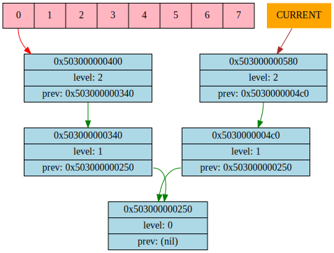
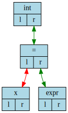
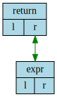
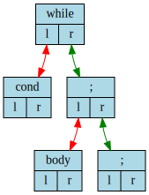
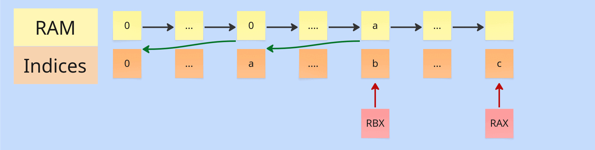

# Frontend
includes Lexical and Syntax Analysis

## Grammar
```
// []  - works exactly 1 time
// ()  - works 0 или 1 times
// []* - works >= 1 times
// ()* - works >= 0 times

Program         := (FuncDec | StatementList) "!END_TOKEN!"

FuncDec         := DataTypes IDENTIFIER "(" (Parameters) ")" [Block | ";"]
Parameters      := DataTypes IDENTIFIER ("," DataTypes IDENTIFIER)*

StatementList   := [Statement]*
Statement       := VarDec
                 | Assignment
                 | IfStatement
                 | WhileStatement
                 | ReturnStatement
                 | Block
                 | ExprStatement


IfStatement     := "if" "(" Expression ")" Block
                    ("else if" "(" Expression ")" Block)*
                    ("else" Block)
WhileStatement  := "while" "(" Expression ")" Block
ReturnStatement := "return" Expression ";"

Block           := "{" StatementList "}"
ExprStatement   := Expression ";"

VarDec          := DataTypes IDENTIFIER ("=" Expression) ";"
Assignment      := [IDENTIFIER "="]* Expression ";"

Expression      := LogicalOr

LogicalOr       := LogicalAnd ( "||" LogicalAnd )*
LogicalAnd      := Equality ( "&&" Equality )*

Equality        := Comparison ( ["==" | "!="] Comparison )*
Comparison      := Term ( ["<" | ">" | "<=" | ">="] Term )*

Term            := Factor ( ['+''-'] Factor )*
Factor          := Primary ( ['*''/'] Primary )*
Primary         := FuncCall | IDENTIFIER | NUM | '('E')' | "true" | "false"

FuncCall        := IDENTIFIER ( "(" (Arguments) ")" )

Arguments       := Expression ("," Expression)*
DataTypes       := "short" | "int" | "long" | "char" | "void" | "float"

IDENTIFIER      := TYPE_VARIABLE
NUM             := TYPE_NUMBER
```

# Symbol Table
is the polytree (directed tree) consisting of scopes (nodes). Global scope - the root, last nested scopes - leaves (pointers to them are located in an additional stack).
Each scope consists HashTable of symbols. Branches related to functions declared globally can extend from the root (there can't be nested functions).



# AST standart

## Assignment
```c
x = y = z = expr;
```


## Variable Declaration
```c
int x = expr;
```


```c
int x;
```


## Functions

### Function Declaration
```c
int func(int a, char b) {...}
```


### Function Call
```c
func(args)
```


### Return Statement
```c
return expr;
```


## Loops

### While Statement
```c
while (cond) {
  body;
}
```


## Conditional operators

### If Statement
```c
if (cond) {
  body;
} else if {
  body;
} else {
  body;
}
```


## Mark Nodes

### ';' - sentinel node
Aim:
* connects statements, parameters, arguments
* marks scope

## Code Example
```c
int fib(int n) {
    int a = 1;
    int b = 1;

    int i = 1;
    while (i < n) {
        int temp = b;
        b = a;
        a = temp;
        a = a + b;

        i = i + 1;
    }

    return a;
}

int main() {
    int f = fib(10);

    return 0;
}
```


# Backend

## Assembly Code Generation
Обход AST выполняется в прямом порядке следования инструкций написанной пользователем программы, генерируя ассемблерный код.

В SPU хранятся 3 регистра: RAX, RBX, RCX.

В ассемблерном коде RAX
* является указателем на свободный кусок RAM
* используется для сохранения/удаления данных в RAM.


### The order of filling RAM.
RAM заполняется последовательно слева направо с помощью RAX:
```c
int x = 86;
```
```asm
PUSH 86
POPM [RAX]
CALL move_rax_by_one
```


Так как при обходе AST текущее значение RAX неизвестно, необходимо при входе в функцию/scope запомнить начальное значение RAX во втором регистре RBX и инициализировать счётчик относительного смещения RAX в RAM для сохранения переменных в символьной таблице и последующего взаимодействия с ними в ассемблерном коде.

Для доступа к переменной в RAM используется RCX:
```c
x;
```
```asm
: set_rcx_offset
PUSHR RBX
ADD
POPR RCX
RET

: get_rax_by_offset
CALL set_rcx_offset
PUSHM [RCX]
RET

PUSH 1                  ; rax_offset for x
CALL get_rax_by_offset
```
Для каждой переменной значение относительного смещения RAX в RAM на момент её инициализации хранится в символьной таблице.

Представление в RAM перехода в функцию:



То есть перед вызовом функции/заходом в новую область видимости
* сохраняется значение RBX в RAM[RAX] для того, чтобы можно было вернуть RBX в предыдущее состояние (после выхода из функции)
* RBX = RAX
* RAX++ 

Перед выходом из функции/области видимости
* RAX = RBX
* RBX = RAM[RBX]

Пример:
```c
int func(int n) {
  return 0;
}

int main() {
  func(86);

  return 0;
}
```
```asm
PUSH 0                ; RAX init
POPR RAX

PUSH 0
POPR RBX              ; RBX init

PUSH 0
POPR RCX              ; RCX init

JMP main
HLT

: move_rax_by_one
PUSH 1
PUSHR RAX
ADD
POPR RAX
RET

: enter_scope
PUSHR RBX
POPM [RAX]
PUSHR RAX
POPR  RBX
CALL move_rax_by_one
RET

: exit_scope
PUSHR  RBX
POPR   RAX
PUSHM [RBX]
POPR   RBX
RET

: func
CALL enter_scope
PUSH 0
CALL exit_scope
RET

: main
CALL enter_scope

PUSH 86

CALL func

PUSH 0
CALL exit_scope
RET
```

### Boolean Expressions Handler
Two parameters accepted by binary relations of the form
* <
* \>
* ==
* !=

are replaced on the stack by 1 or 0 with jumps.

Example:
```c
2 < 3
```
should look like this
```asm
PUSH 2
PUSH 3
JBE false_comparison_result
PUSH 1
JMP truth_comparison_result
:   false_comparison_result
PUSH 0
:   truth_comparison_result
```

If boolean expression consists only of a number, then this number is replaced by
* 1, number >= 1
* 0, number < 1

Example:
```c
2
```
should look like this
```asm
PUSH 2
PUSH 1
JA false_comparison_result
PUSH 1
JMP truth_comparison_result
:   false_comparison_result
PUSH 0
:   truth_comparison_result
```

Land and Lor will be checked using indicator functions:
* a && b <=> I(a) * I(b)
* a || b <=> I(a) + I(b) - I(a) * I(b)

........................................................................................................................................................................................
### Scope Handler

### Initialization Handler

### Keeping Variables


